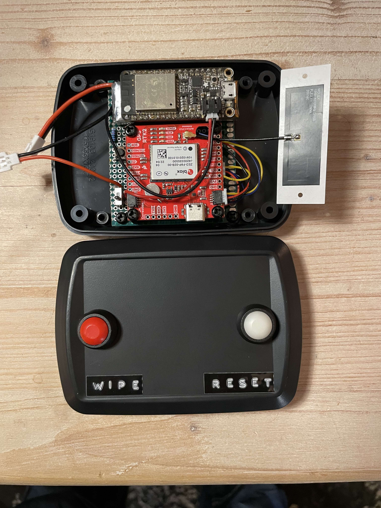

# RTKRover
## Headtracker + Real Time Kinematics (RTK rover)

 

Hardware used:   
* Adafruit Feather ESP32 Huzzah 
* SparkFun GPS-RTK-SMA Breakout - ZED-F9P (Qwiic)
* SparkFun BNO080 Breakout
* ublox ANN-MB1 antenna
* LiPo battery
* Push button(s)
* Resistor 10 k
* Switch

Infrastructure:
* WiFi (e. g. a personal hotspot)
* free line of sight between antenna (horizontal placed) an sky

### Dependencies
* [ESPAsyncWebServer](https://github.com/me-no-dev/ESPAsyncWebServer)
* [RTKRoverManager](https://github.com/jangleboom/RTKRoverManager)

### Circuit diagram


### Configuration

BNO080:

In main.cpp line 763 (or near) you can choose the way of sensor fusion in the BNO080.

````
  // Activate IMU functionalities
  // bno080.enableRotationVector(BNO080_ROT_VECT_UPDATE_RATE_MS);  
  // bno080.enableGameRotationVector(BNO080_ROT_VECT_UPDATE_RATE_MS);  
  bno080.enableARVRStabilizedRotationVector(BNO080_ROT_VECT_UPDATE_RATE_MS);

`````

more information in the [datasheet](https://www.ceva-dsp.com/wp-content/uploads/2019/10/BNO080_085-Datasheet.pdf)


ZED-F9P:

To connect to a caster you need to create a secrets.h file with your credentials that lives in your src folder and looks like this:

````
#ifndef CASTER_SECRETS_H
#define CASTER_SECRETS_H
// A place for your caster credentials

// RTK2Go http://www.rtk2go.com:2101/SNIP::STATUS#uptime

const char kCasterHost[] = "rtk2go.com"; 
const char kCasterPort[] = "2101";
const char kMountPoint[] = "YOUR_MOUNT_POINT";
const char kCasterUser[] = "YOUR_USER_EMAIL";       // User must provide their own email address to use RTK2Go
const char kCasterUserPw[] = "";                    // This can be added to the web form if you want to use a PW here, it's not neccecary

// Device name 
const char kDeviceName[] = "YOUR_ROVER_DEVICE_NAME"; // e. g. "rover123"          
// Wifi access
const char kWifiSsid[] = "YOUR_SSID_WITHOUT_SPACES"; // Wifi to connect the rover with
const char kWifiPw[] = "YOUR_WIFI_PASSWORD";

#endif /*** CASTER_SECRETS_H ***/

````

If you are not using the web form of the RTKBaseManager, then you have to replace the dynamically read credentials with the constant ones (use the k prefixed values e. g: mountPoint --> kMountPoint) in the main.cpp.


The mklittlefs file in the root dir you have to [get](https://github.com/earlephilhower/mklittlefs/releases) depending on your OS.
If you have the Arduino IDE installed, you can borrow it from there too. On macOS you can find it here: `~/Library/Arduino15/packages/esp32/tools/mklittlefs/3.0.0-gnu12-dc7f933/mklittlefs`.  Help for setup the file system you can find [here](https://randomnerdtutorials.com/esp8266-nodemcu-vs-code-platformio-littlefs/). This project was created on macOS (silicon).

[Support RTK2GO](http://new.rtk2go.com/donations-and-support/)

### ESP32 board LED error codes:

* 0.1 s       - BLE: not connected
* 0.5 s       - RTK: setupGNSS() failed (I2C setup)
* 1 s	        - RTK: setupGNSS() failed (I2C communication)
* 2 s 	      - RTK: credentialsExists false
* 1s:0.1s     - WiFi: connection to AP lost
