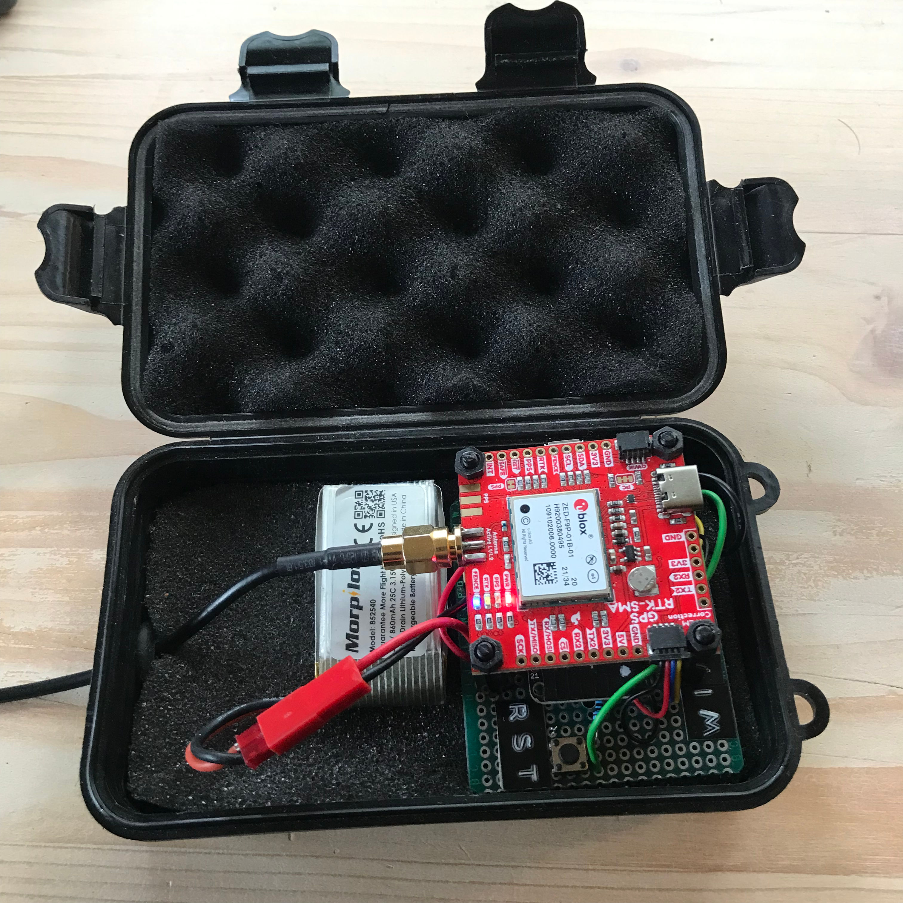

 

# RTKRover
## Headtracker + Real Time Kinematics (RTK rover)

Hardware used:   
* Adafruit Feather ESP32 Huzzah 
* SparkFun GPS-RTK-SMA Breakout - ZED-F9P (Qwiic)
* SparkFun BNO080 Breakout
* ublox ANN-MB1 antenna
* LiPo battery
* Push button(s)
* Resistor 10 k
* Switch

Infrastructure:
* WiFi (e. g. a personal hotspot)
* free line of sight between antenna (horizontal placed) an sky

### Dependencies
* [ESPAsyncWebServer](https://github.com/me-no-dev/ESPAsyncWebServer)
* [RTKRoverManager](https://github.com/jangleboom/RTKRoverManager)

### Circuit diagram


### Configuration
To connect to a caster you need to create a secrets.h file with your credentials that looks like this:

````
#ifndef CASTER_SECRETS_H
#define CASTER_SECRETS_H
// A place for your caster credentials

// RTK2Go MountPoint http://www.rtk2go.com:2101/SNIP::STATUS#uptime
// Email: YOUR_ACCOUNT_EMAIL.COM
const char kCasterHost[] = "rtk2go.com";
const uint16_t kCasterPort = 2101;
const char kMountPoint[] = "YOUR_RTK2GO_MOUNT_POINT";       //The mount point you want to push data to
const char kCasterUser[] = "YOUR_RTK2GO_ACCOUNT_EMAIL.COM";  //User must provide their own email address to use RTK2Go
const char kCasterUserPW[] = "";

// Or

// Another free NTRIP Caster is Emlid
// Emlid Caster MountPoint
// Email: YOUR_ACCOUNT_EMAIL.COM
const char kCasterHost[] = "caster.emlid.com";
const uint16_t kCasterPort = 2101;
const char kCasterUser[] = "YOUR_EMLID_USER_NAME";   //User name and pw must be obtained through their web portal
const char kMountPoint[] = "YOUR_EMLID_MOUNT_POINT"; //The mount point you want to push data to
const char kMountPointPW[] = "YOUR_EMLID_USER_PASSWORD";

// Use only one of this choices!

#endif /*** CASTER_SECRETS_H ***/

````

If you are not using the web form of the RTKBaseManager, then you have to replace the dynamically read credentials with the constant ones (use the k prefixed values e. g: mountPoint --> kMountPoint) in the main.cpp.


The mklittlefs file in the root dir you have to [get](https://github.com/earlephilhower/mklittlefs/releases) depending on your OS.
Or if you have Arduino IDE installed, you can borrow it from there. On macOS you can find it here: `~/Library/Arduino15/packages/esp32/tools/mklittlefs/3.0.0-gnu12-dc7f933/mklittlefs`.  Help for setup the file system you can find [here](https://randomnerdtutorials.com/esp8266-nodemcu-vs-code-platformio-littlefs/). This project was created on macOS (silicon).

